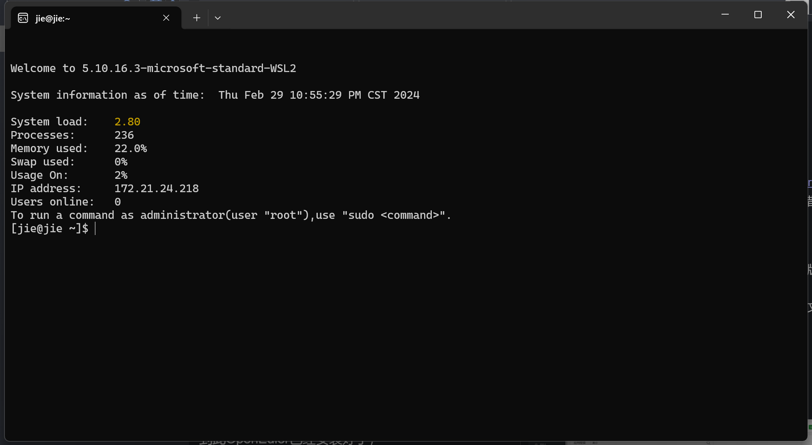
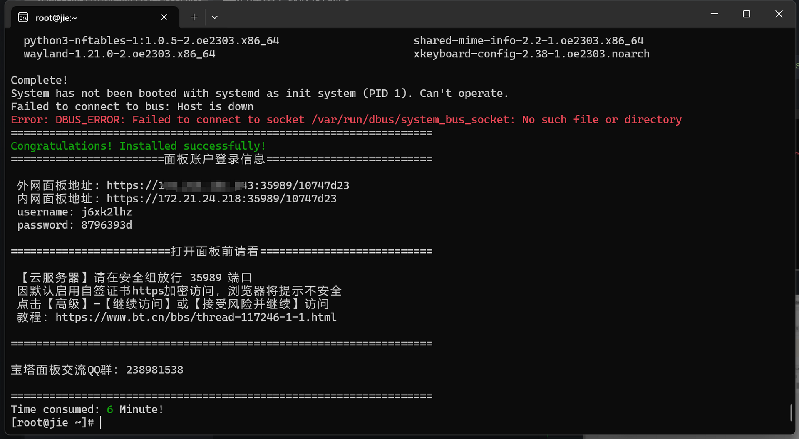
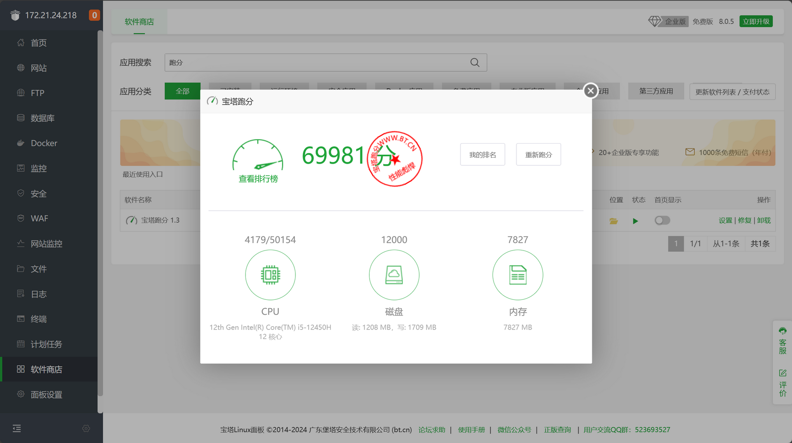
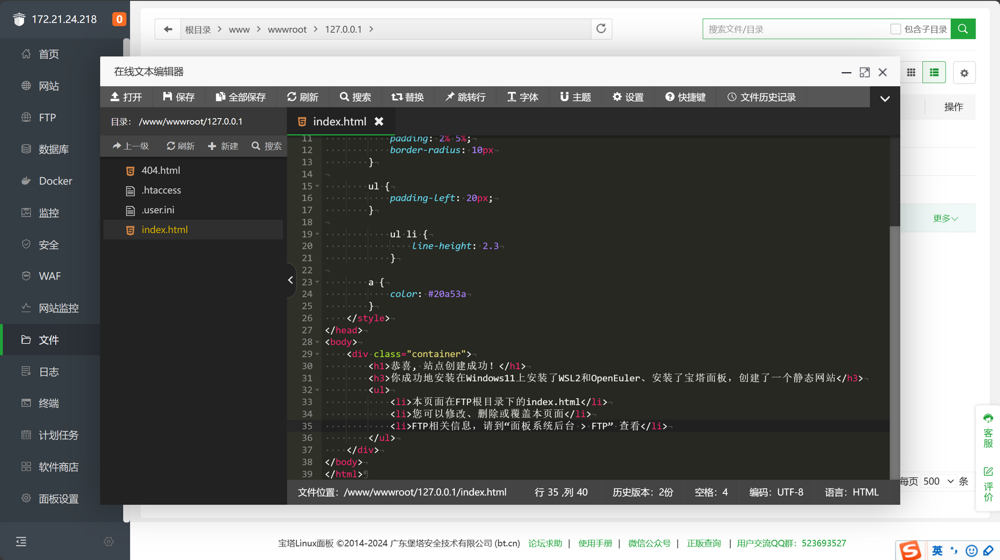
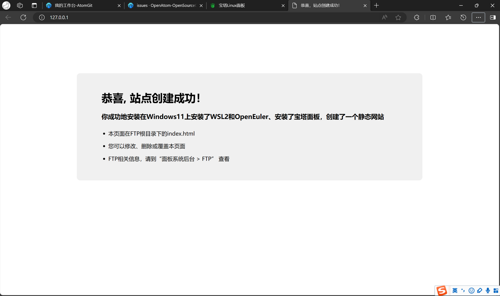

## 1. 安装WSL
### 
首先，在 启用或关闭windows功能 中打开：
**Hyper-V**
**适用于Linux的Windows子系统**
**虚拟机平台**

然后，下载 wsl2 需要使用的 linux 内核，在 https://docs.microsoft.com/zh-cn/windows/wsl/wsl2-kernel 页面点击下载wsl内核更新包，否则会报 0x800701bc 错：

## 2. 安装OpenEuler
接下来，到微软应用商店，搜索OpenEuler，选择一个版本安装，我安装的是23.03
等到下载安装完成，点击OpenEuler，会继续下载一些文件，然后是输入用户名和两遍密码。
## 3. 体验OpenEuler之安装宝塔面板
到此OpenEuler已经安装好了，

可以用`sudo su -`进入root用户。
我们安装个宝塔面板玩一下
宝塔官网：https://www.bt.cn/new/download.html
我们使用万能安装脚本
```
if [ -f /usr/bin/curl ];then curl -sSO https://download.bt.cn/install/install_panel.sh;else wget -O install_panel.sh https://download.bt.cn/install/install_panel.sh;fi;bash install_panel.sh ed8484bec
```
安装好了

点击内网地址，进入宝塔面板，我们跑个分

安装一下ngnix，创建个静态网页，修改一下默认的index

体验完美
